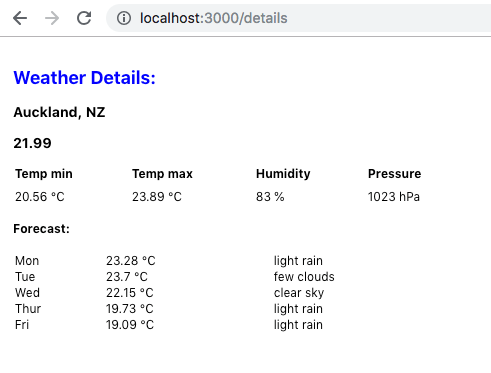

# Weatherman

Weatherman react training project.

## Getting Started

These instructions will get you a copy of the project up and running on your local machine for development and testing purposes. 

### Installing

Use node v16.

Install node modules

```
yarn
```

### Running the app

In a terminal, run:

```
yarn start
```

## Project Overview

The home page for the site is the [Search](src/modules/search/components/Search.tsx) screen.
Type a location name into the text input to find matching locations.
On clicking a result you will be navigated to the [Details](src/modules/details/components/Details.tsx) screen.
This is where the current weather and forecast will be displayed.


## Libraries

### Redux

Global state management

### Typescript FSA

Easy to read actions with less boilerplate. Async actions for network/database calls.

### Sagas

Listen for redux actions and perform network/database calls. Emit success/failure action on result.


## Tasks

Your task is to implement the location details screen. Try to get something similar to this basic design:



Suggested steps:
1. Create an async action in [actions](src/modules/details/actions.ts) that will be used to fetch forecast for a given location id. Use the action `fetchLocationsAction` as a guide.
2. Dispatch this action from the useEffect inside [Details](src/modules/details/components/Details.tsx).
3. Implement the functions `handleFetchForecast` in api [sagas](src/modules/api/sagas.ts) and `fetchForecast` in [functions](src/modules/api/functions.ts) that will handle the api call for your new action. The api call to fetch the forecast for a location is `http://api.openweathermap.org/data/2.5/forecast?&units=metric&mode=json&APPID={APP_ID}&id={LOCATION_ID}`.
4. Store the `FetchForecastResponse` response in the [details reducer](src/modules/details/reducer.ts). Use the search reducer as a guide for storing loading and error states too.
5. Finally display the forecast information in the Details ui. Consider making a reusable component for rendering the Day forecast.

Bonus:
1. Handle displaying loading and error states when fetching the forecast.
